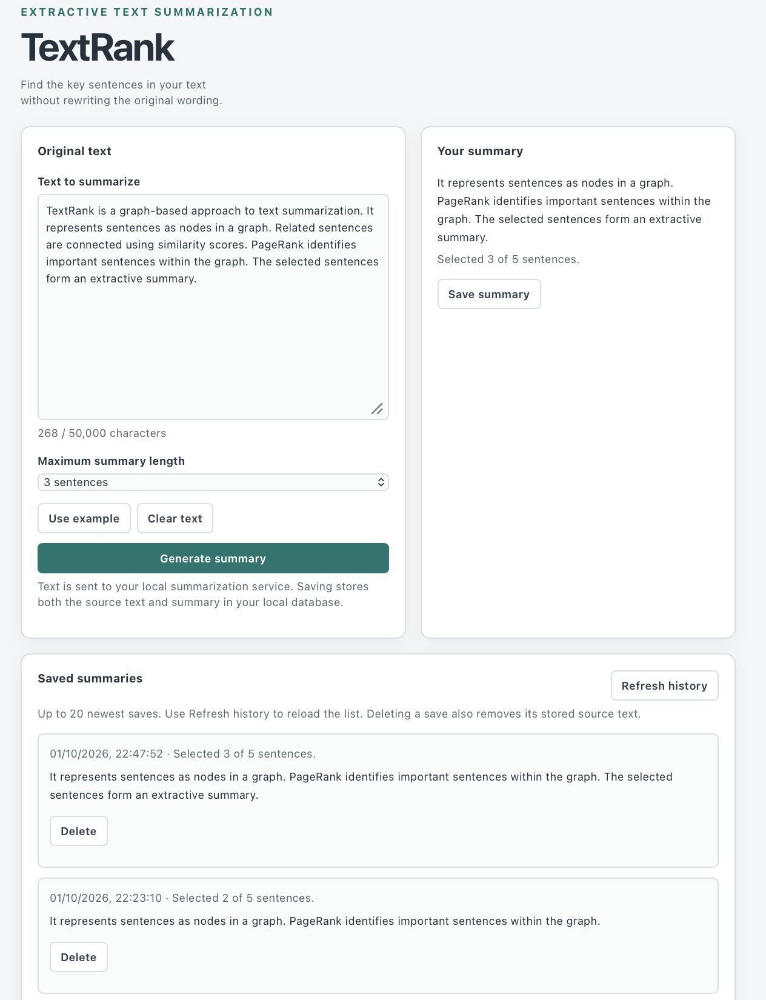

# TextRank Fullstack Summarization Application

[](https://github.com/fierce-bri/TextRank-based-Text-Summarizer/actions/workflows/tests.yml)
[](https://github.com/fierce-bri/TextRank-based-Text-Summarizer/actions/workflows/docker.yml)
[](https://github.com/fierce-bri/TextRank-based-Text-Summarizer/actions/workflows/web.yml)

A fullstack extractive text-summarization application built with **React, Node.js, Express, PostgreSQL, FastAPI, scikit-learn, and NetworkX**.

The application accepts arbitrary text, ranks important sentences using **TF-IDF sentence similarity and TextRank/PageRank**, and returns a concise summary while preserving the original wording and document order.

The project began as a university NLP notebook and has since been refactored and extended into a multi-service application with a browser interface, backend API layer, persistent summary history, automated tests, Docker tooling, and continuous integration.

## Demo

<p align="center">
  
</p>

<p align="center">
  <em>
    React interface for generating, saving, reviewing, and deleting
    TextRank summaries.
  </em>
</p>

## What the Application Does

Users can:

- Enter or paste text into a responsive React interface
- Choose the maximum number of sentences in the generated summary
- Generate an extractive summary using the Python TextRank service
- See loading, validation, timeout, and dependency-error states
- Save generated summaries to PostgreSQL
- View the 20 most recently saved summaries
- Delete individual saved summaries with confirmation
- Recover cleanly when the Python summarization service is unavailable

## Architecture

```text
                       Browser
                          │
                          ▼
                 React + Vite frontend
                          │
                     /api requests
                          │
                          ▼
                 Node.js / Express API
                    │             │
                    │             │
             summarization     persistence
                    │             │
                    ▼             ▼
              FastAPI API     PostgreSQL 17
                    │
                    ▼
           TextRank summarization
                    │
          ┌─────────┴─────────┐
          ▼                   ▼
   TF-IDF similarity      PageRank graph
```

The responsibilities are deliberately separated:

- **React** manages browser interaction and user-facing state.
- **Node.js / Express** acts as the application API layer, handles persistence operations, and communicates with the Python service.
- **FastAPI** owns summarization validation and exposes the TextRank algorithm over HTTP.
- **PostgreSQL** stores saved summaries and metadata.
- **Docker Compose** provides the local PostgreSQL service.
- The existing **Dockerfile** packages the standalone Python summarization API.

## Technology Stack

| Layer | Technologies |
|---|---|
| Frontend | React 19, JavaScript, Vite |
| Application API | Node.js 24, Express 5 |
| NLP API | Python, FastAPI, Pydantic |
| Summarization | scikit-learn, TF-IDF, NetworkX, PageRank |
| Database | PostgreSQL 17, node-postgres |
| Testing | pytest, Node.js test runner |
| DevOps | Docker, Docker Compose, GitHub Actions |

## What I Designed and Implemented

### Summarization Engine

- Refactored the original notebook into reusable Python modules
- Built TF-IDF sentence representations
- Calculated sentence-to-sentence similarity
- Constructed a weighted sentence graph
- Used PageRank to identify important sentences
- Preserved original document order in the returned summary
- Added fallback ranking for disconnected graphs and PageRank convergence failure
- Added validated FastAPI request and response models

### React Frontend

- Built a responsive browser interface for text submission
- Added controlled input state and summary-length selection
- Added loading, success, timeout, and error states
- Connected the frontend to the Node API through a Vite development proxy
- Added summary saving
- Added persistent history display
- Added deletion confirmation and history refresh behavior
- Added client-side response validation before displaying API results

### Node.js / Express API

- Added a Node.js application layer between the browser and Python service
- Added timeout and error handling for upstream Python requests
- Added PostgreSQL connection pooling
- Added request validation for saved summaries
- Used parameterized SQL queries for persistence operations
- Added health, summarization, history, save, and delete routes
- Separated Express application creation from server startup for testability
- Added safe responses for malformed input and dependency failures

### PostgreSQL Persistence

- Designed a `saved_summaries` relational table
- Added UUID identifiers and timestamps
- Added database-level text and sentence-count constraints
- Added a newest-first history index
- Created a restricted application database role
- Limited the application role to `SELECT`, `INSERT`, and `DELETE`
- Kept administrator and application credentials outside source control

### Testing and CI

- Maintained Python unit and API tests for the summarization service
- Added isolated Node API tests using controlled database and upstream-service substitutes
- Added frontend production-build checks
- Added GitHub Actions workflows for Python tests, Node API tests, React builds, Docker builds, and API smoke tests

## How TextRank Works

1. Normalizes whitespace and splits the input into sentences.
2. Converts sentences into TF-IDF vectors.
3. Calculates sentence-to-sentence cosine similarity.
4. Removes weak relationships using a configurable similarity threshold.
5. Builds a weighted graph where sentences are nodes and similarities are edges.
6. Runs PageRank to score sentence importance.
7. Selects the highest-ranked sentences.
8. Restores selected sentences to their original document order.
9. Falls back to TF-IDF relevance if the graph contains no useful edges or PageRank does not converge.

The summarizer is **extractive**, so every sentence in the result comes directly from the submitted text.

## Application API

The Node.js application API runs locally on port `3001`.

| Method | Path | Purpose |
|---|---|---|
| `GET` | `/api/health` | Check the Node API |
| `POST` | `/api/summarize` | Forward a summarization request to FastAPI |
| `POST` | `/api/summaries` | Save a generated summary |
| `GET` | `/api/summaries` | Return the 20 newest saved summaries |
| `DELETE` | `/api/summaries/:id` | Delete one saved summary |

The save and delete operations use parameterized SQL queries rather than concatenating client input into SQL statements.

## Python Summarization API

The FastAPI service runs locally on port `8000`.

| Method | Path | Purpose |
|---|---|---|
| `GET` | `/health` | Check Python service health |
| `POST` | `/summarize` | Generate an extractive summary |
| `GET` | `/docs` | Interactive Swagger documentation |
| `GET` | `/redoc` | ReDoc documentation |
| `GET` | `/openapi.json` | Generated OpenAPI schema |

### Example Request

```json
{
  "text": "TextRank represents sentences as graph nodes. Related sentences are connected by weighted edges. PageRank scores the sentence nodes. The highest-ranked sentences form the summary.",
  "sentence_count": 2,
  "similarity_threshold": 0.05
}
```

### Example Response

```json
{
  "summary": "TextRank represents sentences as graph nodes. Related sentences are connected by weighted edges.",
  "original_sentence_count": 4,
  "selected_sentence_count": 2
}
```

## Run the Full Application Locally

### Requirements

You will need:

- Python 3.11 or newer
- Node.js 24 or a compatible recent LTS release
- npm
- Docker with Docker Compose
- Git

The commands below use a macOS/Linux shell.

### 1. Clone the repository

```bash
git clone https://github.com/fierce-bri/TextRank-based-Text-Summarizer.git
cd TextRank-based-Text-Summarizer
```

### 2. Configure PostgreSQL

Copy the public environment template:

```bash
cp .env.example .env
```

Open `.env` and assign a unique value to:

```dotenv
POSTGRES_PASSWORD=
```

Do not commit `.env`.

Start PostgreSQL:

```bash
docker compose up -d db
```

Check its status:

```bash
docker compose ps
```

The database should report `healthy`.

### 3. Create the database schema

Apply the schema migration:

```bash
docker compose exec -T db psql -X -U postgres -d textrank \
  -v ON_ERROR_STOP=1 -f - \
  < server/db/migrations/001_create_saved_summaries.sql
```

Create the restricted application role:

```bash
docker compose exec -T db psql -X -U postgres -d textrank \
  -v ON_ERROR_STOP=1 -f - \
  < server/db/setup_app_role.sql
```

Open PostgreSQL:

```bash
docker compose exec db psql -X -U postgres -d textrank
```

Inside `psql`, assign a private password and enable login:

```text
\password textrank_app
ALTER ROLE textrank_app LOGIN;
\q
```

### 4. Configure the Node API

Copy the application environment template:

```bash
cp server/.env.example server/.env
```

Set `PGPASSWORD` in `server/.env` to the password assigned to `textrank_app`.

The local settings use:

```dotenv
PGHOST=127.0.0.1
PGPORT=5432
PGDATABASE=textrank
PGUSER=textrank_app
PGPASSWORD=
```

Do not commit `server/.env`.

Install the Node dependencies:

```bash
cd server
npm ci
```

Start the Node API:

```bash
npm run dev
```

The API will be available at:

```text
http://127.0.0.1:3001
```

### 5. Start the Python summarization service

In a second terminal, return to the repository root and create a virtual environment if one does not already exist:

```bash
python3 -m venv .venv
source .venv/bin/activate
python -m pip install -r requirements.txt
```

Start FastAPI:

```bash
python -m uvicorn app.main:app \
  --host 127.0.0.1 \
  --port 8000 \
  --reload \
  --reload-dir app
```

Interactive API documentation:

```text
http://127.0.0.1:8000/docs
```

### 6. Start the React frontend

In a third terminal, from the repository root:

```bash
cd frontend
npm ci
npm run dev
```

Open:

```text
http://localhost:5173/
```

For local development, Vite forwards `/api` requests to the Node server on port `3001`.

## Run the Tests

### Python

Install the development dependencies:

```bash
python -m pip install -r requirements-dev.txt
```

Run the Python suite:

```bash
python -m pytest -q
```

The Python tests cover the summarization algorithm, request validation, API behavior, sentence counts, document ordering, invalid input, and fallback behavior.

### Node.js

From `server/`:

```bash
npm ci
npm test
```

The Node tests cover:

- Health responses
- Summarization forwarding
- Malformed JSON
- Content-type validation
- Invalid saved-summary payloads
- Parameterized persistence queries
- Empty and populated history responses
- Invalid deletion IDs
- Successful deletion
- Missing records
- Safe database failure responses
- Unavailable Python-service handling

The Node API tests use controlled substitutes for PostgreSQL and the Python service. They verify application behavior without modifying the developer's real local database.

### React Build

From `frontend/`:

```bash
npm ci
npm run build
```

This verifies that the React application can produce a production build.

## Continuous Integration

Three GitHub Actions workflows verify different parts of the repository.

### Python Tests

Runs the pytest suite against:

- Python 3.11
- Python 3.12
- Python 3.13

### Docker

The Docker workflow:

- Builds the standalone FastAPI image
- Starts the Python API container
- Waits for the health endpoint
- Sends a real `/summarize` request
- Checks returned sentence metadata
- Prints container logs if the smoke test fails

### Web Checks

The web workflow:

- Uses Node.js 24
- Installs dependencies with `npm ci`
- Runs the Node API test suite
- Builds the React frontend

The Node CI tests do not require database passwords because they use controlled database substitutes.

## Docker

The root `Dockerfile` packages the **Python summarization API** as a standalone container.

Build it:

```bash
docker build --tag textrank-summarizer .
```

Run it:

```bash
docker run --rm --publish 8000:8000 textrank-summarizer
```

Then open:

```text
http://127.0.0.1:8000/docs
```

`compose.yaml` is currently used to provide the local PostgreSQL service for the fullstack development environment.

## Project Structure

```text
.
├── .github/
│   └── workflows/
│       ├── docker.yml
│       ├── tests.yml
│       └── web.yml
├── app/
│   ├── __init__.py
│   ├── main.py
│   ├── schemas.py
│   └── summarizer.py
├── docs/
│   └── screenshots/
│       └── textrank-fullstack-demo.png
├── frontend/
│   ├── src/
│   │   ├── App.jsx
│   │   ├── App.css
│   │   ├── SaveSummary.jsx
│   │   ├── SavedSummaries.jsx
│   │   ├── SavedSummaries.css
│   │   └── index.css
│   ├── package.json
│   └── package-lock.json
├── server/
│   ├── db/
│   │   ├── migrations/
│   │   │   └── 001_create_saved_summaries.sql
│   │   └── setup_app_role.sql
│   ├── scripts/
│   │   └── check-db.js
│   ├── src/
│   │   ├── app.js
│   │   ├── db.js
│   │   └── index.js
│   ├── tests/
│   │   └── app.test.js
│   ├── .env.example
│   ├── package.json
│   └── package-lock.json
├── tests/
│   ├── test_api.py
│   └── test_summarizer.py
├── .env.example
├── compose.yaml
├── Dockerfile
├── requirements-dev.txt
├── requirements.txt
├── text_summarization.ipynb
└── README.md
```

## Design Decisions

### Separate the NLP Engine from the Web Application

The Python summarization logic remains independent of React, Node.js, and PostgreSQL.

The browser talks to the Node API, while Node forwards summarization requests to FastAPI. This keeps the NLP implementation reusable and gives the application layer a separate place for persistence and workflow logic.

### Preserve Document Order

PageRank determines sentence importance, but ranking order is not necessarily reading order.

After the most important sentences are selected, they are reordered by their original positions so the summary reads more naturally.

### Handle Weak Similarity Graphs

Some documents contain little vocabulary overlap between sentences.

If the TextRank graph contains no useful edges, or if PageRank does not converge, the implementation falls back to TF-IDF relevance instead of returning an empty result.

### Use a Restricted Database Account

The Node API does not connect to PostgreSQL using the database administrator account.

The application role receives only the permissions currently needed:

```text
SELECT
INSERT
DELETE
```

It is not granted `UPDATE`, `TRUNCATE`, database-creation, role-management, or superuser permissions.

### Parameterize Database Queries

Values submitted by the client are passed to PostgreSQL separately from SQL command text.

For example, saved-summary insertion uses `$1`, `$2`, `$3`, and `$4` parameters rather than constructing SQL with string concatenation.

### Separate App Creation from Server Startup

The Express application is created separately from the code that opens port `3001`.

This allows automated tests to supply controlled database and upstream-service implementations without requiring real credentials or modifying local data.

## Project Background

This project began as a university NLP experiment implemented in a Jupyter notebook.

The first major refactor moved the summarization algorithm into reusable Python modules and exposed it through a validated FastAPI service.

The later fullstack extension added:

- A React browser interface
- A Node.js / Express application API
- PostgreSQL persistence
- Saved-summary history and deletion
- Restricted database permissions
- Additional API tests
- React build checks
- Fullstack-oriented continuous integration

The original notebook remains in the repository as a historical record of the project's academic starting point.

## Current Limitations

- The application currently runs as a local development system rather than a publicly hosted service.
- There is no authentication or per-user ownership model; saved summaries belong to the local application database.
- The save endpoint accepts validated client-submitted summary data rather than atomically generating and saving a result in one backend transaction.
- Saved history is limited to the 20 newest records and does not yet support pagination or search.
- History refresh after saving is currently manual.
- The React UI does not yet have automated browser/component tests.
- Node API tests use controlled dependency substitutes rather than a real PostgreSQL integration environment.
- Database migrations are currently SQL files applied manually rather than through a dedicated migration framework.
- The lightweight sentence splitter may not handle every abbreviation, decimal, or unusual punctuation pattern.
- TF-IDF currently uses English stop words.
- Similarity calculation materializes a dense sentence-similarity matrix, so very large documents can require substantial memory.
- Summarization requests are processed synchronously and in memory.
- The summarizer is extractive and does not rewrite or paraphrase sentences.

## Possible Future Improvements

- Add automated PostgreSQL integration tests
- Add React component or browser-level tests
- Add automatic history refresh after a successful save
- Add pagination and search for saved summaries
- Add user authentication and per-user data ownership
- Introduce a database migration framework
- Keep sentence similarities sparse for larger documents
- Add top-k graph construction or hierarchical summarization
- Benchmark output quality with ROUGE and labeled evaluation data
- Add structured logging and request tracing
- Deploy the complete application to a public cloud environment

## Author

Developed and maintained by **Aphiwe Mzulwini**.

- GitHub: [fierce-bri](https://github.com/fierce-bri)
- LinkedIn: [Aphiwe Mzulwini](https://www.linkedin.com/in/aphiwe-mzulwini-310214318)
